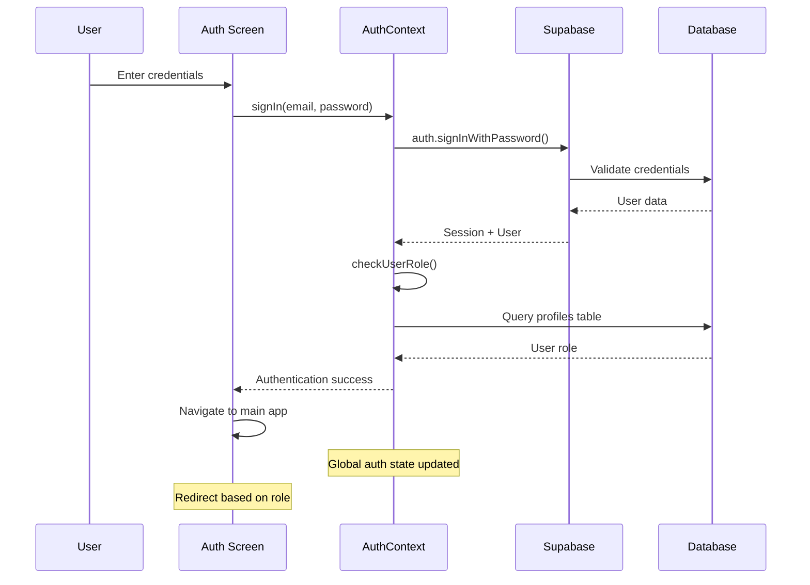
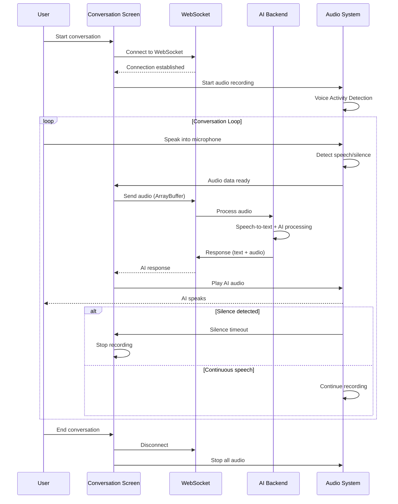
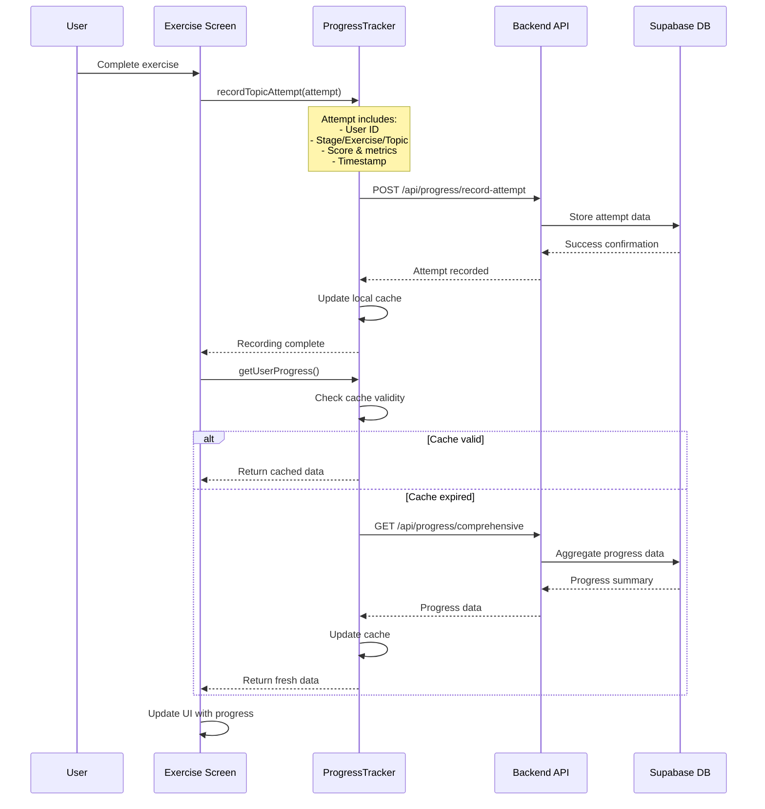
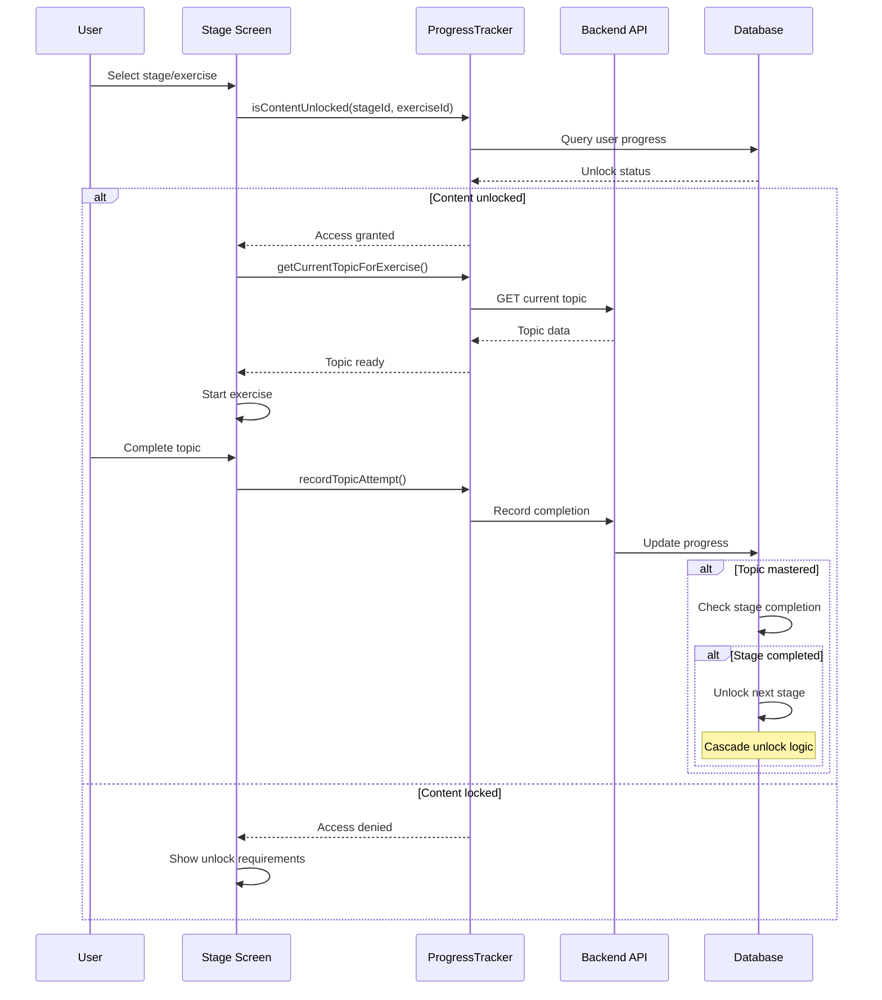
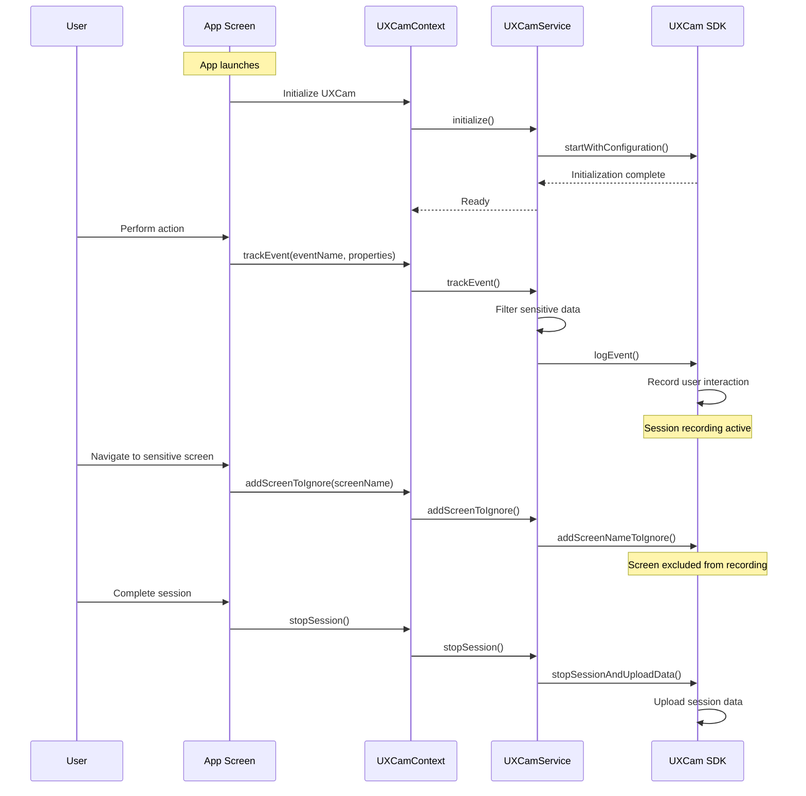
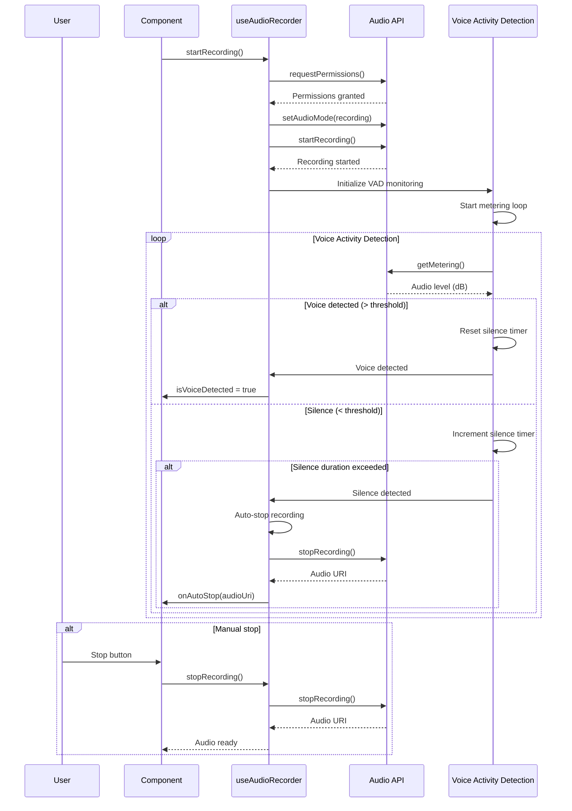

# AI Tutor App - Technical Documentation

## Table of Contents
1. [System Overview](#system-overview)
2. [Architecture](#architecture)
3. [Core Components](#core-components)
4. [Authentication System](#authentication-system)
5. [Learning System](#learning-system)
6. [Real-time Communication](#real-time-communication)
7. [Progress Tracking](#progress-tracking)
8. [UX Analytics](#ux-analytics)
9. [Sequence Diagrams](#sequence-diagrams)
10. [File Structure](#file-structure)
11. [Dependencies](#dependencies)

## System Overview

The AI Tutor App is a React Native/Expo application designed for English language learning through AI-powered voice conversations. The app provides multiple learning modes, progress tracking, and real-time voice interaction with an AI tutor.

### Key Features
- **Real-time Voice Conversations**: Two distinct modes (Learn and English-Only)
- **Voice Activity Detection (VAD)**: Automatic speech detection and silence handling
- **Progress Tracking**: Comprehensive learning analytics and achievement system
- **Multi-stage Learning Path**: 7 stages from beginner to advanced
- **Authentication**: Supabase-based user management with role-based access
- **UX Analytics**: UXCam integration for user behavior tracking
- **Offline Support**: Graceful degradation when services are unavailable

## Architecture

### Technology Stack
- **Frontend**: React Native with Expo Router
- **Authentication**: Supabase Auth
- **Database**: Supabase PostgreSQL
- **Real-time Communication**: WebSocket connections
- **Audio Processing**: expo-av, expo-speech
- **State Management**: React Context API
- **Navigation**: Expo Router (file-based routing)
- **Analytics**: UXCam for user experience tracking
- **Styling**: StyleSheet with LinearGradient and animations

### Project Structure
```
ai-tutor-app/
├── app/                          # Expo Router pages
│   ├── _layout.tsx              # Root layout with providers
│   ├── index.tsx                # Loading screen
│   ├── auth/                    # Authentication screens
│   ├── (tabs)/                  # Tab-based navigation
│   │   ├── learn/               # Learning modes
│   │   ├── practice/            # Practice stages
│   │   ├── progress/            # Progress tracking
│   │   └── profile/             # User profile
│   └── onboarding/              # User onboarding
├── components/                   # Reusable UI components
├── context/                     # React Context providers
├── hooks/                       # Custom React hooks
├── services/                    # Business logic services
├── utils/                       # Utility functions
└── config/                      # Configuration files
```

## Core Components

### 1. Root Layout (`app/_layout.tsx`)
The root layout manages global application state and providers:

**Key Responsibilities:**
- Font loading and splash screen management
- Global error handling (JavaScript errors, unhandled promises, native errors)
- Hermes memory management optimization
- Provider setup (Auth, LanguageMode, UXCam)
- Authentication-based routing

**Global Error Handlers:**
- JavaScript errors with stack traces
- Unhandled promise rejections
- Native call errors (iOS/Android specific)
- Hermes garbage collection optimization

### 2. Authentication Context (`context/AuthContext.tsx`)
Manages user authentication state and operations:

**Features:**
- Supabase integration for auth operations
- User role management (student/teacher/admin)
- Session persistence
- Password reset functionality
- User metadata handling (firstName, lastName, grade)

**Key Functions:**
- `signIn(email, password)`: User login
- `signUp(userData)`: User registration with role assignment
- `signOut()`: Session termination
- `resetPassword(email)`: Password reset flow
- `checkUserRole()`: Role verification from profiles table

### 3. Language Mode Context (`context/LanguageModeContext.tsx`)
Simple context for managing UI language preferences:
- Supports 'english' and 'urdu' modes
- Used for localization and UI text translation

## Authentication System

### User Registration Flow
1. User provides personal information (name, email, grade, password)
2. Client-side validation (email format, password strength, field completion)
3. Supabase user creation with metadata
4. Default role assignment ('student')
5. Email verification prompt
6. Redirect to login screen

### Login Flow
1. Email/password input with validation
2. Supabase authentication
3. Role verification from profiles table
4. Session establishment
5. Redirect to main application

### Role-Based Access
- **Student**: Default role, access to learning content
- **Teacher**: Enhanced access (future implementation)
- **Admin**: Full system access (future implementation)

Roles are stored in both `user_metadata` and a separate `profiles` table for flexibility.

## Learning System

### Learning Stages
The app provides 7 progressive learning stages:

1. **Stage 0**: Beginner Lessons (Alphabet, Phonics, Numbers, Sight Words, Navigation)
2. **Stage 1**: A1 Beginner - Foundation Building
3. **Stage 2**: A2 Elementary - Basic Communication
4. **Stage 3**: B1 Intermediate - Practical Usage
5. **Stage 4**: B2 Upper-Intermediate - Fluent Expression
6. **Stage 5**: C1 Advanced - Sophisticated Communication
7. **Stage 6**: C2 Proficiency - Native-like Fluency

### Exercise Types
Each stage contains multiple exercise types:
- **Repeat After Me**: Pronunciation practice
- **Quick Response Prompts**: Fast thinking exercises
- **Listen and Reply**: Comprehension and response
- **Daily Routine**: Conversational practice
- **Roleplay**: Scenario-based learning
- **Storytelling**: Narrative skills
- **Problem Solving**: Critical thinking in English
- **Mock Interviews**: Professional communication
- **Academic Presentations**: Formal speaking skills

### Learning Modes

#### 1. Conversation Mode (`app/(tabs)/learn/conversation.tsx`)
Traditional structured learning with Urdu-to-English translation support:

**Features:**
- Word-by-word pronunciation practice
- Urdu translation assistance
- Structured lesson progression
- Feedback and correction system
- Progress tracking per lesson

**Key States:**
- `word_by_word`: Breaking down pronunciation
- `playing_you_said`: Audio playback of user speech
- `english_input_edge_case`: Handling unexpected English input

#### 2. English-Only Mode (`app/(tabs)/learn/english-only.tsx`)
Advanced ChatGPT-like voice conversation mode:

**Features:**
- Continuous English conversation
- Context-aware AI responses
- Personalized greetings and corrections
- Advanced conversation management
- Session tracking and analytics

**Key States:**
- `greeting`: Initial AI introduction
- `listening`: Recording user speech
- `speaking`: AI response playback
- `pause_detected`: Handling conversation pauses
- `no_speech_detected`: Managing silence periods

## Real-time Communication

### WebSocket Architecture
The app uses dedicated WebSocket connections for real-time AI communication:

#### Connection Management (`utils/websocket.ts`)
**Learn WebSocket** (`/api/ws/learn`):
- Structured learning conversations
- Lesson-specific interactions
- Progress tracking integration

**English-Only WebSocket** (`/api/ws/english-only`):
- Free-form conversations
- Context-aware responses
- Advanced conversation management

**Message Types:**
- JSON messages for control and metadata
- ArrayBuffer for audio data transmission
- Connection timeout handling
- Automatic reconnection logic

### Voice Activity Detection (VAD)
Sophisticated audio processing for natural conversation flow:

**Implementation (`hooks/useAudioRecorder.ts`):**
- Real-time audio level monitoring
- Configurable silence thresholds
- Minimum speech duration requirements
- iOS metering calibration
- Automatic recording start/stop

**Timing Configuration (`utils/chatgptTimingConfig.ts`):**
- `VAD_THRESHOLD`: -45 dB (adjustable per device)
- `SILENCE_DURATION`: 2000ms for conversation pauses
- `MIN_SPEECH_DURATION`: 500ms to filter noise
- `MAX_RECORDING_DURATION`: 30s safety limit

### Audio Management (`utils/audioManager.ts`)
Singleton pattern for audio playback control:
- Prevents multiple simultaneous audio streams
- Automatic cleanup of previous audio
- Audio session management
- Cross-platform compatibility

## Progress Tracking

### Progress Tracker Service (`services/progressTracker.ts`)
Comprehensive learning analytics system:

**Key Features:**
- Topic attempt recording with detailed metrics
- Comprehensive progress retrieval
- Content unlock management
- Caching with retry mechanisms
- Supabase integration for progress persistence

**Progress Metrics:**
- Overall completion percentage
- Stage-specific progress
- Exercise completion rates
- Learning streaks and time tracking
- Topic mastery levels

**API Integration:**
- RESTful backend communication
- Retry logic for failed requests
- Offline mode support
- Progress synchronization

### Progress Visualization (`app/(tabs)/progress/index.tsx`)
Advanced progress dashboard with:

**Visual Components:**
- Circular progress indicators with animations
- Stage roadmap with completion status
- Achievement system with badges
- Learning statistics with trend analysis
- Glassmorphism design with blur effects

**Data Presentation:**
- Real-time progress updates
- Expandable stage details
- Exercise-level progress tracking
- Completion statistics with bar charts
- Learning time analytics

## UX Analytics

### UXCam Integration
Comprehensive user experience tracking:

#### UXCam Service (`services/UXCamService.ts`)
**Features:**
- Cross-platform session recording
- Custom event tracking
- User property management
- Privacy-compliant data collection
- Mock implementation for development

**Configuration:**
- Automatic screen name tagging
- Sensitive screen exclusion
- Recording quality optimization
- Session duration management
- Privacy mode support

#### UXCam Context (`context/UXCamContext.tsx`)
**Capabilities:**
- Global UXCam state management
- Session lifecycle management
- User identity tracking
- Event logging with properties
- Privacy controls (opt-in/opt-out)

**Development Support:**
- Mock UXCam for Expo Go
- Real UXCam for production builds
- Graceful fallback handling
- Debug logging for development

## Sequence Diagrams

### 1. User Authentication Flow



### 2. Real-time Voice Conversation Flow



### 3. Progress Tracking Flow



### 4. Learning Stage Progression Flow



### 5. UXCam Analytics Flow



### 6. Audio Recording with VAD Flow



## File Structure

### Core Application Files

#### Root Level
- `app.json` - Expo configuration with bundle IDs and plugins
- `package.json` - Dependencies and project metadata
- `tsconfig.json` - TypeScript configuration

#### App Directory (`app/`)
- `_layout.tsx` - Root layout with global providers and error handling
- `index.tsx` - Loading screen component
- `auth/` - Authentication screens (login, signup)
- `(tabs)/` - Tab-based navigation structure
- `onboarding/` - User onboarding flow

#### Context Providers (`context/`)
- `AuthContext.tsx` - Authentication state management
- `LanguageModeContext.tsx` - UI language preferences
- `UXCamContext.tsx` - Analytics context

#### Services (`services/`)
- `UXCamService.ts` - UX analytics service with mock support
- `progressTracker.ts` - Learning progress management

#### Utilities (`utils/`)
- `websocket.ts` - WebSocket connection management
- `audioManager.ts` - Audio playback control
- `chatgptTimingConfig.ts` - VAD timing constants

#### Configuration (`config/`)
- `api.ts` - API endpoints and base URLs
- `uxcam.ts` - UXCam configuration settings
- `supabase.ts` - Supabase client initialization

#### Components (`components/`)
- `LoadingScreen.tsx` - Global loading component
- `CircularProgress.tsx` - Animated progress indicator
- `progress/` - Progress-specific components
- `ui/` - Reusable UI components

#### Hooks (`hooks/`)
- `useAudioRecorder.ts` - Voice recording with VAD
- `useAuth.ts` - Authentication hook
- `useUXCam.ts` - UXCam integration hook

## Dependencies

### Core Dependencies
```json
{
  "expo": "~52.0.0",
  "react": "18.3.1",
  "react-native": "0.76.1",
  "expo-router": "~4.0.0"
}
```

### Authentication & Database
```json
{
  "@supabase/supabase-js": "^2.39.3",
  "expo-secure-store": "~14.0.0"
}
```

### Audio & Media
```json
{
  "expo-av": "~15.0.0",
  "expo-speech": "~12.1.0"
}
```

### UI & Animations
```json
{
  "expo-linear-gradient": "~14.0.0",
  "lottie-react-native": "7.1.0",
  "@expo/vector-icons": "^14.0.0",
  "expo-blur": "~14.0.0"
}
```

### Analytics & Monitoring
```json
{
  "react-native-ux-cam": "^6.6.1"
}
```

### Development Tools
```json
{
  "@typescript-eslint/eslint-plugin": "^7.7.0",
  "eslint": "^8.57.0",
  "typescript": "~5.3.3"
}
```

## Key Features Implementation

### 1. Offline Support
- Mock Supabase client for offline development
- Cached progress data with fallback mechanisms
- Graceful degradation of UXCam analytics
- Local audio processing capabilities

### 2. Error Handling
- Global JavaScript error boundaries
- Unhandled promise rejection handling
- Native error catching (iOS/Android)
- Network failure recovery
- Audio permission handling

### 3. Performance Optimization
- Hermes memory management
- Lazy loading of components
- Audio session optimization
- WebSocket connection pooling
- Progress data caching

### 4. Accessibility
- Screen reader support
- Voice-first interaction design
- High contrast UI elements
- Keyboard navigation support

### 5. Security
- Secure token storage (expo-secure-store)
- Environment variable protection
- Sensitive data filtering in analytics
- Privacy-compliant user tracking

## Development Guidelines

### 1. Code Organization
- Feature-based directory structure
- Separation of concerns (UI, business logic, data)
- Reusable component library
- Consistent naming conventions

### 2. State Management
- Context API for global state
- Local state for component-specific data
- Immutable state updates
- Proper cleanup in useEffect

### 3. Error Handling
- Try-catch blocks for async operations
- Proper error boundaries
- User-friendly error messages
- Logging for debugging

### 4. Testing Strategy
- Unit tests for utility functions
- Integration tests for API calls
- Component testing with React Native Testing Library
- End-to-end testing with Detox

This technical documentation provides a comprehensive overview of the AI Tutor App's architecture, implementation details, and key flows. The sequence diagrams illustrate the complex interactions between components, making it easier to understand the system's behavior and maintain the codebase.
